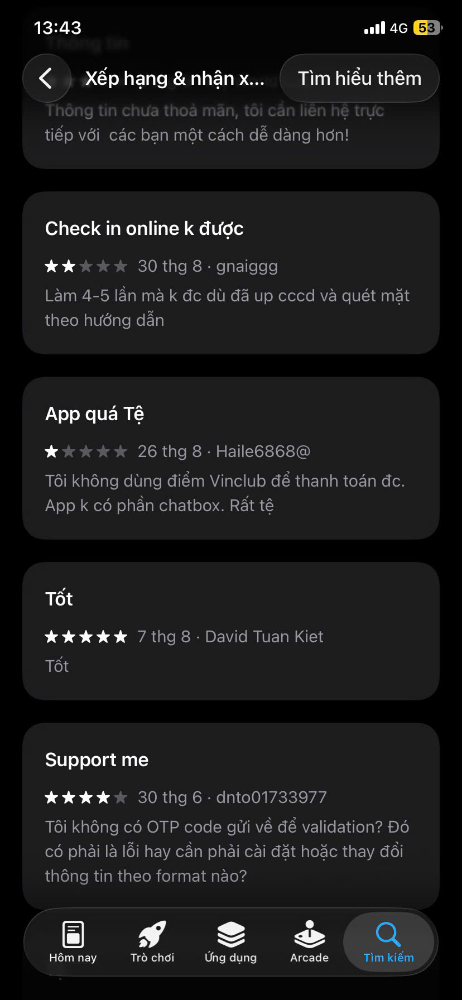
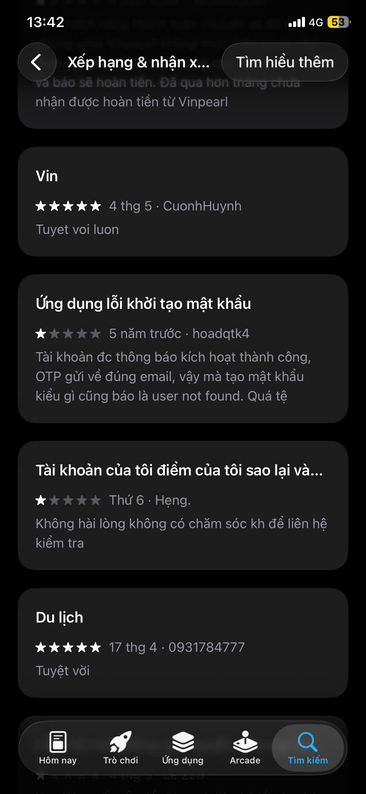
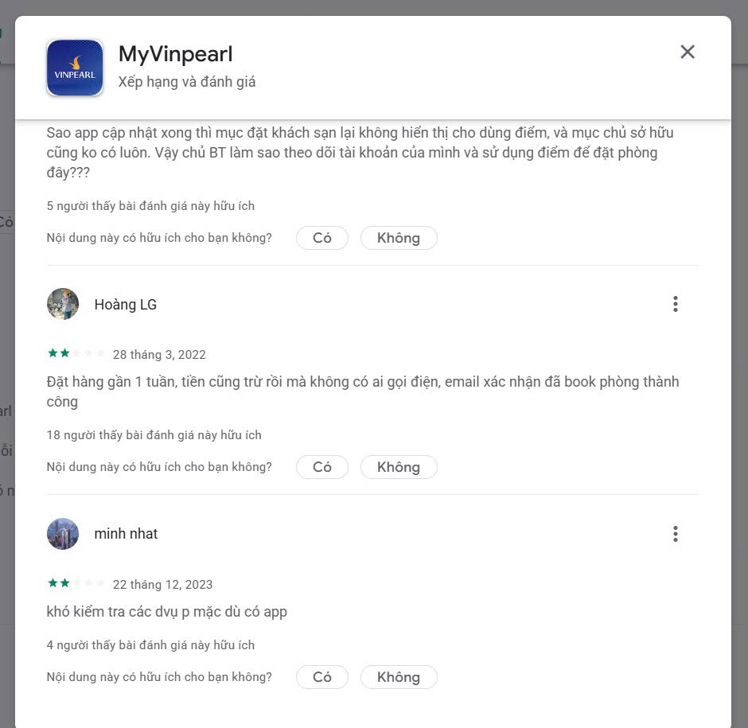

# SPEC sản phẩm

Ở Day 5, mỗi nhóm đã viết một bản SPEC nhẹ. Đến Day 6, nhóm hoàn thiện bản này cho đủ để bắt tay vào build và mang đi demo — vẫn ngắn gọn, nhưng đủ để bảo vệ được những quyết định sản phẩm của mình.

Hãy hình dung SPEC như một lập luận, chứ không phải một danh sách tính năng. Nó cần trả lời rõ bốn câu hỏi: sản phẩm giải vấn đề gì và cho ai, AI tham gia quyết định điều gì, chuyện gì xảy ra khi AI trả lời sai, và những nhận định của nhóm dựa trên bằng chứng nào.

Viết SPEC vào `spec/spec.md`, có thể kèm slide demo (`spec/demo-slides.pdf`).

---

## 1. Bằng chứng

nhóm tự dùng app/workflow lưu trú thật và ghi lại điểm gãy.

| Evidence ID | Observation | Screenshot/link | Path liên quan | Điều học được |
|---|---|---|---|---|
| **E01** | Khách phản ánh tiêu cực vì không có chatbot hỗ trợ | [noChatbot.jpg](noChatbot.jpg)  | **Failure (Service Latency / High Friction)** |  |
| **E02** | Khách gặp vấn đề thông qua app nhưng lại không có CSKH để liên hệ | [ev2_1.jpg](ev2_1.jpg)  | **Low-confidence** | Tránh ép khách gọi điện. Để AI trả lời FAQ tiện ích tức thời ngay trong phòng qua QR, giảm tải cho lễ tân. |
| **E03** | Các dịch vụ/ tiện ích trong resort nằm rải rác nhiều nơi, người ở khó tìm  | [ev3.jpg](ev3.jpg)  | **Failure / Correction** | Gom yêu cầu dịch vụ về một hội thoại. AI draft yêu cầu, chuyển bộ phận phù hợp; khách xác nhận bằng nút bấm. |
| **E04** |Quy trình đặt thông qua app quá phức tạp, phải chọn từng mục sau đó mới hiển thị ra các thông tin  | Thông qua trải nghiệm/ Kiểm chứng app | **Failure / Correction** | Gom yêu cầu dịch vụ về một hội thoại. AI draft yêu cầu, chuyển bộ phận phù hợp; khách xác nhận bằng nút bấm. |

## 2. Lát cắt để build

Web App/Zalo Mini App kích hoạt qua mã QR đặt trong phòng hoặc trên thẻ phòng (Zero-Install, không cần đăng nhập app). Khi quét, hệ thống tự nhận diện số phòng + thời điểm hiện tại và mở một hội thoại concierge ngắn (Conversational UI dùng Gemini API). AI trả lời ngay các câu hỏi về tiện ích (giờ buffet, hồ bơi, shuttle, gym, spa) và tiếp nhận yêu cầu dịch vụ đơn giản (xin thêm khăn/nước, đặt bàn nhà hàng, đặt slot spa, xin late check-out) bằng 2–3 nút phản hồi nhanh, thay vì bắt khách gọi điện lễ tân hoặc lục trong app đặt phòng nặng nề.

## 3. AI Product Canvas

Canvas là một trang giúp sản phẩm không trôi ngược về "một demo cho vui". Nhóm trả lời lần lượt bốn ô:

| Ô | Câu hỏi cần trả lời |
|---|---------------------|
| **Value** — Giá trị | Khách lưu trú resort phức hợp; đau ở độ trễ lễ tân, thông tin rải rác, đặt dịch vụ rời rạc, app nặng. AI: concierge tức thời qua QR, không cần gọi điện hay tải app. |
| **Trust** — Niềm tin | Sai/thiếu chắc → hỏi lại bằng nút; hết slot → gợi ý khung khác; đổi/hủy/hoàn tiền/khiếu nại → không tự xác nhận, [Chuyển lễ tân] + tóm tắt cho nhân viên. |
| **Feasibility** — Tính khả thi | Gemini API + mock tiện ích/slot; prototype 1 ngày. Rủi ro lớn nhất: AI hứa hẹn sai về tiền/chính sách. Ngưỡng dừng: intent rủi ro luôn escalate. |
| **Tín hiệu học** | Khách bấm escalate hoặc chỉnh gợi ý → ghi vào profile phiên tạm (ưu tiên dịch vụ, không thích spa…) cho gợi ý sau trong cùng lưu trú.|

## 4. Tăng năng lực hay tự động hóa

Quyết định: Conditional automation — AI tự xử lý trong case hẹp (FAQ, amenity đơn giản); case mơ hồ/rủi ro chuyển người.

Lý do: FAQ và amenity rủi ro thấp, đáp án rõ → tự xử lý giảm tải lễ tân. Đổi/hủy, hoàn tiền, khiếu nại cần con người. Conditional automation cho vùng an toàn + escalate khi vượt ngưỡng.

| Vai trò con người | Ai | Làm gì |
|------------------|----|---------|
| Decider | Khách | Xác nhận yêu cầu do AI draft trước khi gửi |
| Rescuer | Lễ tân / Nhân viên | Nhận các trường hợp AI escalate khi không chắc chắn, yêu cầu phức tạp hoặc vượt chính sách |

## 5. Bốn đường đi của trải nghiệm

Một tính năng AI không chỉ có đường thuận. Nhóm cần thiết kế cho cả bốn tình huống mà người dùng có thể gặp:

| Đường đi | Câu hỏi | Ví dụ cách xử lý |
|----------|---------|------------------|
| **Đường thuận** | AI đúng và tự tin — người dùng thấy gì? | Gợi ý hiện rõ, chấp nhận chỉ bằng một thao tác |
| **Khi AI không chắc** | AI lưỡng lự — có hỏi lại không? | Đưa ra vài lựa chọn hoặc xin thêm thông tin |
| **Khi AI sai** | Kết quả sai — người dùng gỡ ra thế nào? | Cho hoàn tác, sửa trực tiếp, hoặc chuyển sang người thật |
| **Khi người dùng sửa** | Người dùng chỉnh lại — dữ liệu đi về đâu? | Lưu lại để cập nhật quy tắc hoặc tập kiểm thử |

## 6. Những kiểu lỗi đáng lo nhất

Liệt kê một đến ba kiểu lỗi nguy hiểm nhất của sản phẩm. Với mỗi kiểu, nói rõ ba điều: lỗi thường xuất hiện khi nào (chẳng hạn đầu vào mơ hồ, câu hỏi ngoài phạm vi, dữ liệu thiếu, hay người dùng cố tình đánh lừa), nếu xảy ra thì ai chịu thiệt và nặng đến đâu, và prototype sẽ xử lý bằng cách nào — hỏi lại, hiện nguồn, để con người duyệt, cho hoàn tác, hay có sẵn phương án dự phòng.

## 7. Kế hoạch kiểm thử và bằng chứng demo

Để chứng minh được khi đứng demo, nhóm chuẩn bị sẵn hai đầu vào để thử: một đầu vào bình thường cho đường thuận, và một đầu vào khó hoặc gây nhiễu để cho thấy sản phẩm phục hồi ra sao khi AI không chắc. Bên cạnh đó, giữ lại các bằng chứng trong quá trình làm: ảnh chụp màn hình, nhật ký prompt, các trường hợp đã test, và những đánh đổi mà nhóm đã cân nhắc khi quyết định.

## 8. Phân công

Cuối cùng, ghi rõ ai phụ trách phần nào — người viết và kiểm thử prompt, người dựng giao diện, người giữ repo, người viết kịch bản demo, và người lo phần bằng chứng. Mỗi thành viên cần có một phần đủ rõ để tự mình giải thích được khi demo.
